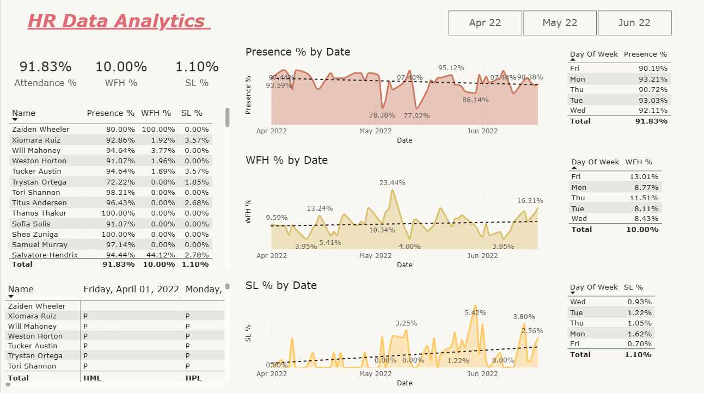

# 📊 HR Analytics Dashboard

This repository contains an Dyanamic HR analytics project that provides insights into employee attendance, work-from-home (WFH) trends, and sick leave (SL) statistics using **Power BI Desktop**.
project is build upon the real dataset of company


## 📌 Overview

The dataset includes:

- **Attendance %**: Employee presence rates across different months.
- **WFH %**: Trends in work-from-home adoption over time.
- **SL %**: Sick leave patterns analyzed by date and day of the week.
- **Employee Insights**: Individual presence, WFH, and SL statistics.

## 📈 Key Metrics

- **Overall Attendance Rate**: **91.83%**
- **WFH Rate**: **10.00%**
- **SL Rate**: **1.10%**
- **Best Attendance Day**: **Monday (93.21%)**
- **Highest WFH Day**: **Friday (13.01%)**
- **Lowest Sick Leave Day**: **Friday (0.70%)**

## 🛠️ Tools Used

- **Power BI Desktop** for visualization and insights
- **Excel / CSV Processing** for data structuring
- **Python (Pandas, Matplotlib)** *(optional for preprocessing and further analysis)*
  


## 📌 Features

- 📅 **Monthly & Weekly Attendance Trends**
- 🏠 **Work-from-Home Analysis**
- 🤒 **Sick Leave Trends by Date & Day of the Week**
- 👥 **Employee-Specific Attendance & WFH Insights**
- 📊 **Interactive Power BI Dashboard for Data Exploration**

## 🚀 How to Use

1. Clone the repository:
   ```bash
   git clone https://github.com/yourusername/hr-analytics-dashboard.git
   ```
2. Open the dataset in **Power BI** or **Excel**.
3. Explore trends, filter data, and generate insights.
4. *(Optional)* Use Python scripts for additional analysis.

## 📢 Contributions

Feel free to contribute by improving visualizations, adding more analytics features, or integrating ML models for trend prediction.

## 📧 Contact

For any queries or suggestions, reach out via GitHub Issues or email me at lokesh18.ml@gmail.com.
